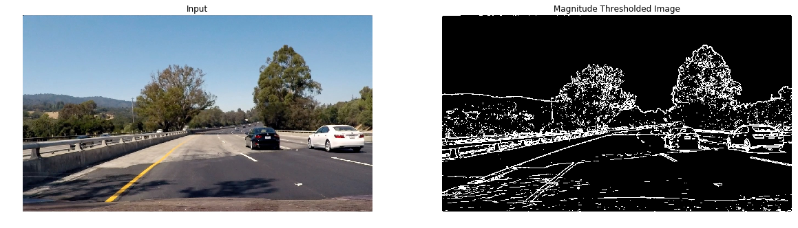

# Advanced Lane Finding  

The goal of this project is to use advanced computer vision techniques to find lanes on roads. 
* Compute the camera calibration matrix and distortion coefficients given a set of chessboard images.
* Apply a distortion correction to raw images.
* Use color transforms, gradients, etc., to create a thresholded binary image.
* Apply a perspective transform to rectify image ("birds-eye view").
* Detect lane pixels and fit to find the lane boundary.
* Determine the curvature of the lane and vehicle position with respect to center.
* Warp the detected lane boundaries back onto the original image.
* Output visual display of the lane boundaries and numerical estimation of lane curvature and vehicle position.


## Compute the camera calibration matrix and distortion coefficients given a set of chessboard images.
The images from the camera have two kinds of transformations which needs to be corrected before we can accurately measure distances using the images.
1. Lens Distortion: Straight lines appear curved. There are two kinds of distortion radial and tangential. In case of radial distortion, the edges of the image appear distorted such that lines or objects appear more of less curved than they actually are. In case of tangential distortion the images look tilten so that some objects are appear father away or closer  than they actually are. 
2. Perspective Projection :Straght lines are preserved but angles are not preserved. Objects appear larger close to the camera, while distant objects appear small. 


### Removing Lens Distortion: 
The lens disortion can be removed by computing the distortion coefficients for radial and tangential distortion and camera matrix and then computing the corrected images. OpenCV  has  `findChessboardCorners` and `calibrateCamera` functions that are useful in getting the camera matrix. To obtain a camera matrix we need a mapping of the distorted image coordinates `imgpoints = []` and  `objpoints = []`. The chess board provides an easy way to get this mapping as the true coordinates can be easily obtained. 

Below are a sample of images of a chessboard pattern taken using the camera used to record the dash cam video. 


```python

objpoints = []
imgpoints = []

objp = np.zeros(((6*9),3),np.float32)
objp[:,:2] = np.mgrid[0:9,0:6].T.reshape(-1,2)

for image in cal_images:
    gray = cv2.cvtColor(image,cv2.COLOR_BGR2GRAY)
    ret,corners = cv2.findChessboardCorners(gray,(9,6),None)
    if ret == True:
        imgpoints.append(corners)
        objpoints.append(objp)

```

The corners are drawn using OpenCV's `drawChessboardCorners` function which requires the chessboard size and the corners as input.


```python
test_img = np.copy(cal_images[11])


gray = cv2.cvtColor(test_img,cv2.COLOR_BGR2GRAY)
ret,corners = cv2.findChessboardCorners(gray,(9,6),None)
drawn_img = cv2.drawChessboardCorners(test_img, (9,6), corners, ret)
if ret == True:
    imgpoints.append(corners)
    objpoints.append(objp)

show_side_by_side(cal_images[11],drawn_img, title1 = "Chessboard Image",title2 ="Detected Corners")

```


* The mapping between `imgpoints = []` and `objpoints = []` is obtained using the `calibrateCamera` functions. 
```python
ret, mtx, dist, rvecs, tvecs = cv2.calibrateCamera(objpoints, imgpoints, gray.shape[::-1],None,None)
```

* Once we have the camera matrix and the distortion coefficients, the image can be undistorted using `undistort` function. Here are some exampels of applying the `undistort` function on the calibration images. You can notices the lines are long the edges are straighter. `undistort_img` function implements this functionality.

```python
def undistort_img(img, camera_matrix,dist):
    h,  w = img.shape[:2]
    dst = cv2.undistort(img, mtx, dist,None)
    return(dst)
   
```


### Perspective distortion 

Removing perspective distortion involved mapping the points from the undistorted image from the previous step to true coordinates. The OpenCv function `getPerspectiveTransform` is used to map a set of points `src` to `dst`. The `src` points are chosen from the undistorted image and `dst` points are the corresponding points without the perspective distortion. In our case we map the four corners of the chessboard to a rectangle. This step is implemented in `corners_unwarp(img, nx, ny, mtx, dist)` function.


```python
def corners_unwarp(img, nx, ny, mtx, dist):
    undist = cv2.undistort(img, mtx, dist, None, mtx)
    gray = cv2.cvtColor(undist, cv2.COLOR_BGR2GRAY)
    ret, corners = cv2.findChessboardCorners(gray, (nx, ny), None)
    unwarped = None
    M= None
    if ret == True:
        cv2.drawChessboardCorners(undist, (nx, ny), corners, ret)
        offset = 100
        img_size = (gray.shape[1], gray.shape[0])
        src = np.float32([corners[0], corners[nx-1], corners[-1], corners[-nx]])
        dst = np.float32([[offset, offset], [img_size[0]-offset, offset], 
                                     [img_size[0]-offset, img_size[1]-offset], 
                                     [offset, img_size[1]-offset]])
        M = cv2.getPerspectiveTransform(src, dst)
        unwarped = cv2.warpPerspective(undist, M, img_size)
    return unwarped, M
```


### Apply a perspective transform to rectify image ("birds-eye view").
We can remove the perspective distortion from the road images by choosing the `src` and `dst` points in a similar fashion and computing the perspective transformation matrix. The transformation matrix can then be applied to all the images to obtain the bird's eye view. 

Bird's eye view of the images above. 


Side by side comparison 


### Use color transforms, gradients, etc., to create a thresholded binary image.

I tried several combinations of the  thresholding techniques in gradient space and different color spaces. 

* Gradient space (using Sobel filter to get gradeint) thresholding works when the surface of the road is free from shadows and there are no sudden changes in pavement.
* Color space thresholding was found more  effective in detecting the lane pixels. Colorspace thresholding was implemented in `color_threshold(img,colorspace = 'HLS',channel = 2,thresh=(0, 255))` function. 

```python
def color_threshold(img,colorspace = 'HLS',channel = 2,thresh=(0, 255)):
    if(channel<0 | channel >2):
        return -1
    
    binary_output = np.zeros_like(img[:,:,0])
    if(colorspace == 'HLS'):
        image_colorspace = cv2.cvtColor(img,cv2.COLOR_BGR2HLS)
    elif(colorspace == 'Lab'):
        image_colorspace = cv2.cvtColor(img,cv2.COLOR_BGR2Lab)
    elif(colorspace == 'HSV'):
        image_colorspace = cv2.cvtColor(img,cv2.COLOR_BGR2HSV)
    elif(colorspace == 'LUV'):
        image_colorspace = cv2.cvtColor(img,cv2.COLOR_BGR2LUV)
    else:
        return -1
    
    image_channel = image_colorspace[:,:,channel]
    binary_output[(image_channel>=thresh[0]) & (image_channel<=thresh[1])] =1
        
    return binary_output
```

* Detecting the two lane colors separately worked very well by choosing the right colorspace, the channel and the threshold. Particularly `b` channel of `Lab` space with a threshold of `(155, 200)` was effective in detecting the yellow lanes and `L` channel of `LUV` colorspace with a threshold of `(201,255)` was found effective in detecting the white lanes.
* A combined thresholding pipeline is implemented in `threshold_pipeline(img)`.
```python
def threshold_pipeline(img):
    img = np.copy(img)
   
    thresholded_yellow = color_threshold(img,colorspace = 'Lab',channel = 2,thresh=(140, 200))
    thresholded_white = color_threshold(img,colorspace = 'LUV',channel = 0,thresh=(210, 255))

    combined_binary = np.zeros_like(img[:,:,0])
    combined_binary[(thresholded_yellow == 1) | (thresholded_white == 1)] = 1
   
    return combined_binary
```


#### Trying different gradient thresholding techniques.
```python
def abs_sobel_thresh(img, orient='x', thresh_min=0, thresh_max=255):
    gray = cv2.cvtColor(img, cv2.COLOR_RGB2GRAY)
    
    if orient == 'x':
        abs_sobel = np.absolute(cv2.Sobel(gray, cv2.CV_64F, 1, 0))
    if orient == 'y':
        abs_sobel = np.absolute(cv2.Sobel(gray, cv2.CV_64F, 0, 1))
    
    scaled_sobel = np.uint8(255*abs_sobel/np.max(abs_sobel))
    
    binary_output = np.zeros_like(scaled_sobel)
    binary_output[(scaled_sobel >= thresh_min) & (scaled_sobel <= thresh_max)] = 1

    # Return the result
    return binary_output
```


```python
def mag_thresh(img, sobel_kernel=3, mag_thresh=(0, 255)):
    gray = cv2.cvtColor(img,cv2.COLOR_RGB2GRAY)
    
    sobel_x = cv2.Sobel(gray,cv2.CV_64F,1,0,ksize=sobel_kernel)
    sobel_y = cv2.Sobel(gray,cv2.CV_64F,0,1,ksize=sobel_kernel)
    
    mag = np.sqrt(sobel_x**2 + sobel_y**2)
    scale_factor = np.max(mag)/255
    mag_scaled = np.uint8(mag/scale_factor)
    
    binary_output = np.zeros_like(mag_scaled)
    binary_output[(mag_scaled>=mag_thresh[0]) & (mag_scaled<=mag_thresh[1])] =1
  
    return binary_output
```




```python
def dir_threshold(img, sobel_kernel=3, thresh=(0, np.pi/2)):
    gray = cv2.cvtColor(image,cv2.COLOR_RGB2GRAY)
    
    sobel_x = cv2.Sobel(gray,cv2.CV_64F,1,0,ksize=sobel_kernel)
    sobel_y = cv2.Sobel(gray,cv2.CV_64F,0,1,ksize=sobel_kernel)
    
    abs_sobel_x = np.abs(sobel_x)
    abs_sobel_y = np.abs(sobel_y)
    angle = np.arctan2(abs_sobel_y, abs_sobel_x)
    
    binary_output = np.zeros_like(angle)
    binary_output[(angle>=thresh[0]) & (angle <= thresh[1])] = 1
    
    return binary_output
```


Combined Thresholded Image


#### Experimenting with colorspace threshold


Yellow lines are well discovered by b channel of Lab. The white is totally lost.

`L` channel of `LUV` colorspace works well in detecting white pixels. 


Trying out the harder cases for lane detection 


Below is the result of thresholding the images using the `threshold_pipeline` function.


### Detect lane pixels and fit to find the lane boundary

The position of the left and right lanes can be determined by finding the lane centers and then following the lane centers using a sliding window technique. 

A histogram of the pixel counts shows peaks near the lane locations as shown below. 


```python
out_img = np.dstack((combined_threshold, combined_threshold, combined_threshold))*255
midpoint = np.int(histogram.shape[0]/2)
leftx_base = np.argmax(histogram[:midpoint])
rightx_base = np.argmax(histogram[midpoint:]) + midpoint
```
After detecting the peaks, we look for pixels around the center within a given window. This pixels are then used to fit a polynomial using the `numpy` function `polyfit` as implemented in the code below.  


```python
binary_warped = np.copy(combined_threshold)

nwindows = 9
window_height = np.int(binary_warped.shape[0]/nwindows)
nonzero = binary_warped.nonzero()
nonzeroy = np.array(nonzero[0])
nonzerox = np.array(nonzero[1])

leftx_current = leftx_base
rightx_current = rightx_base

margin = 100
minpix = 50
left_lane_inds = []
right_lane_inds = []


# Step through the windows one by one
for window in range(nwindows):
    # Identify window boundaries in x and y (and right and left)
    win_y_low = binary_warped.shape[0] - (window+1)*window_height
    win_y_high = binary_warped.shape[0] - window*window_height
    win_xleft_low = leftx_current - margin
    win_xleft_high = leftx_current + margin
    win_xright_low = rightx_current - margin
    win_xright_high = rightx_current + margin
    # Draw the windows on the visualization image
    cv2.rectangle(out_img,(win_xleft_low,win_y_low),(win_xleft_high,win_y_high),
    (0,255,0), 2) 
    cv2.rectangle(out_img,(win_xright_low,win_y_low),(win_xright_high,win_y_high),
    (0,255,0), 2) 
    # Identify the nonzero pixels in x and y within the window
    good_left_inds = ((nonzeroy >= win_y_low) & (nonzeroy < win_y_high) & 
    (nonzerox >= win_xleft_low) &  (nonzerox < win_xleft_high)).nonzero()[0]
    good_right_inds = ((nonzeroy >= win_y_low) & (nonzeroy < win_y_high) & 
    (nonzerox >= win_xright_low) &  (nonzerox < win_xright_high)).nonzero()[0]
    # Append these indices to the lists
    left_lane_inds.append(good_left_inds)
    right_lane_inds.append(good_right_inds)
    # If you found > minpix pixels, recenter next window on their mean position
    if len(good_left_inds) > minpix:
        leftx_current = np.int(np.mean(nonzerox[good_left_inds]))
    if len(good_right_inds) > minpix:        
        rightx_current = np.int(np.mean(nonzerox[good_right_inds]))

# Concatenate the arrays of indices
left_lane_inds = np.concatenate(left_lane_inds)
right_lane_inds = np.concatenate(right_lane_inds)

# Extract left and right line pixel positions
leftx = nonzerox[left_lane_inds]
lefty = nonzeroy[left_lane_inds] 
rightx = nonzerox[right_lane_inds]
righty = nonzeroy[right_lane_inds] 

# Fit a second order polynomial to each
left_fit = np.polyfit(lefty, leftx, 2)
right_fit = np.polyfit(righty, rightx, 2)
```

Figure below shows a vislualization of the detected left and right lane pixels as shown in red and blue respectively, and the second degree fitted polynomial for each lane in yellow. 


```python
ploty = np.linspace(0, binary_warped.shape[0]-1, binary_warped.shape[0] )
left_fitx = left_fit[0]*ploty**2 + left_fit[1]*ploty + left_fit[2]
right_fitx = right_fit[0]*ploty**2 + right_fit[1]*ploty + right_fit[2]

out_img[nonzeroy[left_lane_inds], nonzerox[left_lane_inds]] = [255, 0, 0]
out_img[nonzeroy[right_lane_inds], nonzerox[right_lane_inds]] = [0, 0, 255]
plt.imshow(out_img)
plt.plot(left_fitx, ploty, color='yellow')
plt.plot(right_fitx, ploty, color='yellow')
plt.xlim(0, 1280)
plt.ylim(720, 0)
```


### Determine the curvature of the lane and vehicle position with respect to center. 

The radius of curvature `R` is computed using `R = ((1+(2Ay+B)^2)^(3/2))/2A` where `f(y) = Ay^2 + By + C` is the equation of the second degree polynomial as implemented below.


```python
# Define conversions in x and y from pixels space to meters
ym_per_pix = 30/720 # meters per pixel in y dimension
xm_per_pix = 3.7/700 # meters per pixel in x dimension

# Fit new polynomials to x,y in world space
left_fit_cr = np.polyfit(ploty*ym_per_pix, left_fitx*xm_per_pix, 2)
right_fit_cr = np.polyfit(ploty*ym_per_pix, right_fitx*xm_per_pix, 2)

# Calculate the new radii of curvature
left_curverad = ((1 + (2*left_fit_cr[0]*y_eval*ym_per_pix + left_fit_cr[1])**2)**1.5) / np.absolute(2*left_fit_cr[0])
right_curverad = ((1 + (2*right_fit_cr[0]*y_eval*ym_per_pix + right_fit_cr[1])**2)**1.5) / np.absolute(2*right_fit_cr[0])
# Now our radius of curvature is in meters
print(left_curverad, 'm', right_curverad, 'm')


## Find the offset of the car 
left_lane_x = left_fit[0]*y_eval**2 + left_fit[1]*y_eval + left_fit[2]
right_lane_x= right_fit[0]*y_eval**2 + right_fit[1]*y_eval + right_fit[2]
lane_center_x = (left_lane_x+right_lane_x)/2

vehicle_offset = (binary_warped.shape[1]/2-lane_center_x)*xm_per_pix

print('Vehicle Offset from Lane Center', vehicle_offset, 'm')
```

    357.18781138082664 m 464.04632285194026 m
    Vehicle Offset from Lane Center -0.14970471693387122 m

```python
def get_radius_of_curvatrure(y_eval,x_coords,y_coords,meters_per_pixel_x = 3.7/700,meters_per_pixel_y = 30/720):
     # Fit new polynomials to x,y in world space
    fit_cr = np.polyfit(y_coords*meters_per_pixel_y, x_coords*meters_per_pixel_x, 2)
    # Calculate the new radii of curvature
    curverad = ((1 + (2*fit_cr[0]*y_eval*meters_per_pixel_y + fit_cr[1])**2)**1.5) / np.absolute(2*fit_cr[0])
    return (curverad)
```
```python
y_eval = np.max(ploty)
left_radius_of_curvature = get_radius_of_curvatrure(y_eval,left_fitx,ploty)
left_radius_of_curvature
```
    464.04632285194026


Image below shows the lane area colored in green.

```python
warp_zero = np.zeros_like(binary_warped).astype(np.uint8)
color_warp = np.dstack((warp_zero, warp_zero, warp_zero))

pts_left = np.array([np.transpose(np.vstack([left_fitx, ploty]))])
pts_right = np.array([np.flipud(np.transpose(np.vstack([right_fitx, ploty])))])
pts = np.hstack((pts_left, pts_right))
op = cv2.fillPoly(color_warp, np.int_([pts]), (0,255, 0))
fig = plt.imshow(op)
plt.show()
```


### Warp the detected lane boundaries back onto the original image.
* The bird's eye view image is mapped back onto the original image by computing the inverse tranformation matrix from the `dst` points to the `src` points using `findHomography(dst, src)`
* The pipeline for processing the image is implemented in `process_image(img)`


```python
camera_matrix = mtx
dist_coeffs = dist
perspective_transform_matrix = mat_perspective
inverse_perspective_transform_matrix = mat_inverse_perspective
lane_poly = np.zeros_like(op)

def process_image(img):
    img_bgr = cv2.cvtColor(img,cv2.COLOR_RGB2BGR)
    undist_road_img = undistort_img(img_bgr, camera_matrix,dist_coeffs)
    image_size = (undist_road_img.shape[1], undist_road_img.shape[0])
    perspective_unwarped_img = cv2.warpPerspective(undist_road_img,perspective_transform_matrix,dsize=image_size,flags=cv2.INTER_LINEAR) 

    binary_warped = threshold_pipeline(perspective_unwarped_img)
    
    nwindows = 9
    window_height = np.int(binary_warped.shape[0]/nwindows)
    nonzero = binary_warped.nonzero()
    nonzeroy = np.array(nonzero[0])
    nonzerox = np.array(nonzero[1])

    leftx_current = leftx_base
    rightx_current = rightx_base

    margin = 100
    minpix = 50
    left_lane_inds = []
    right_lane_inds = []


    # Step through the windows one by one
    for window in range(nwindows):
        # Identify window boundaries in x and y (and right and left)
        win_y_low = binary_warped.shape[0] - (window+1)*window_height
        win_y_high = binary_warped.shape[0] - window*window_height
        win_xleft_low = leftx_current - margin
        win_xleft_high = leftx_current + margin
        win_xright_low = rightx_current - margin
        win_xright_high = rightx_current + margin
        # Draw the windows on the visualization image
        cv2.rectangle(out_img,(win_xleft_low,win_y_low),(win_xleft_high,win_y_high),
        (0,255,0), 2) 
        cv2.rectangle(out_img,(win_xright_low,win_y_low),(win_xright_high,win_y_high),
        (0,255,0), 2) 
        # Identify the nonzero pixels in x and y within the window
        good_left_inds = ((nonzeroy >= win_y_low) & (nonzeroy < win_y_high) & 
        (nonzerox >= win_xleft_low) &  (nonzerox < win_xleft_high)).nonzero()[0]
        good_right_inds = ((nonzeroy >= win_y_low) & (nonzeroy < win_y_high) & 
        (nonzerox >= win_xright_low) &  (nonzerox < win_xright_high)).nonzero()[0]
        # Append these indices to the lists
        left_lane_inds.append(good_left_inds)
        right_lane_inds.append(good_right_inds)
        # If you found > minpix pixels, recenter next window on their mean position
        if len(good_left_inds) > minpix:
            leftx_current = np.int(np.mean(nonzerox[good_left_inds]))
        if len(good_right_inds) > minpix:        
            rightx_current = np.int(np.mean(nonzerox[good_right_inds]))

    # Concatenate the arrays of indices
    left_lane_inds = np.concatenate(left_lane_inds)
    right_lane_inds = np.concatenate(right_lane_inds)

    # Extract left and right line pixel positions
    leftx = nonzerox[left_lane_inds]
    lefty = nonzeroy[left_lane_inds] 
    rightx = nonzerox[right_lane_inds]
    righty = nonzeroy[right_lane_inds] 

    # Fit a second order polynomial to each
    left_fit = np.polyfit(lefty, leftx, 2)
    right_fit = np.polyfit(righty, rightx, 2)
    
    ploty = np.linspace(0, binary_warped.shape[0]-1, binary_warped.shape[0] )
    left_fitx = left_fit[0]*ploty**2 + left_fit[1]*ploty + left_fit[2]
    right_fitx = right_fit[0]*ploty**2 + right_fit[1]*ploty + right_fit[2]
    
    # plot filled polygon     
    warp_zero = np.zeros_like(binary_warped).astype(np.uint8)
    color_warp = np.dstack((warp_zero, warp_zero, warp_zero))

    pts_left = np.array([np.transpose(np.vstack([left_fitx, ploty]))])
    pts_right = np.array([np.flipud(np.transpose(np.vstack([right_fitx, ploty])))])
    pts = np.hstack((pts_left, pts_right))
    color_warp = cv2.fillPoly(color_warp, np.int_([pts]), (0,255, 0))
    
    ## draw lane lines 
    thickness = 10
    pts_left_lane_left = np.array([np.transpose(np.vstack([left_fitx-thickness, ploty]))])
    pts_left_lane_right = np.array([np.flipud(np.transpose(np.vstack([left_fitx+thickness, ploty])))])
    pts = np.hstack((pts_left_lane_left, pts_left_lane_right))
    color_warp = cv2.fillPoly(color_warp, np.int_([pts]), (0,0,255))
    
    pts_right_lane_left = np.array([np.transpose(np.vstack([right_fitx-thickness, ploty]))])
    pts_right_lane_right = np.array([np.flipud(np.transpose(np.vstack([right_fitx+thickness, ploty])))])
    pts = np.hstack((pts_right_lane_left, pts_right_lane_right))
    op = cv2.fillPoly(color_warp, np.int_([pts]), (255,0,0))
    
    
    
    img_redistorted = cv2.warpPerspective(op, inverse_perspective_transform_matrix, dsize=img_size)
    #undist_road_img[(im_redistorted ==1)] = (237,149,100)
    result = cv2.addWeighted(undist_road_img, 1, img_redistorted, 0.5, 0)
    result_rgb = cv2.cvtColor(result,cv2.COLOR_BGR2RGB)
    
    y_eval = np.max(ploty)
    left_radius_of_curvature = get_radius_of_curvatrure(y_eval,left_fitx,ploty)
    right_radius_of_curvature = get_radius_of_curvatrure(y_eval,right_fitx,ploty)
    radius_of_curvature = (left_radius_of_curvature+right_radius_of_curvature)/2
    
    radius_str = "radius of curvature: "+'{:04.2f}'.format(radius_of_curvature) +'m'
    font = cv2.FONT_HERSHEY_SIMPLEX
    cv2.putText(result_rgb,radius_str,(10,100), font, 1,(255,255,255),2,cv2.LINE_AA)
    
    ## calculate offset 
    left_lane_x = left_fit[0]*y_eval**2 + left_fit[1]*y_eval + left_fit[2]
    right_lane_x= right_fit[0]*y_eval**2 + right_fit[1]*y_eval + right_fit[2]
    lane_center_x = (left_lane_x+right_lane_x)/2

    vehicle_offset = (binary_warped.shape[1]/2-lane_center_x)*xm_per_pix
    direction = ''
    if vehicle_offset > 0:
        direction = 'right'
    elif vehicle_offset < 0:
        direction = 'left'
    abs_vehicle_offset = abs(vehicle_offset)

    offset_str='Vehicle Offset: '+'{:04.3f}'.format(abs_vehicle_offset)+'m '+ direction + " of center"
    cv2.putText(result_rgb,offset_str,(10,140), font, 1,(255,255,255),2,cv2.LINE_AA)
    

    return result_rgb
```

Side by side comparison of original image and image with lane overlay.


### Video processing

```python
clip_output_path = '../reports/result.mp4'
clip = VideoFileClip('../data/project_video.mp4')#.subclip(0,5)
new_clip = clip.fl_image(process_image)
new_clip.write_videofile(clip_output_path, audio=False)
```

    [MoviePy] >>>> Building video ../reports/result.mp4
    [MoviePy] Writing video ../reports/result.mp4


    100%|█████████▉| 1260/1261 [01:43<00:00, 12.00it/s]


    [MoviePy] Done.
    [MoviePy] >>>> Video ready: ../reports/result.mp4 
 

### Discussion: Problems encountered during implementation

* Camera Calibration: All the the 20 images supplied do not work when you try to detect corner points. This may be due the chessboard corners being cropped off. I used the images that did return corners.
* Gradient Space Thresholding: Thresholding using Sobel gradient did not work very well for me. I tried using the magnitude, the direction, Sobel x and Sobel y gradients. 
* Choosing the right colorspace,channel and  threshold values for lane detection required some experimenting. A better segmentation algorithm, perhaps something that uses a neural network could be used for lane detection.    

